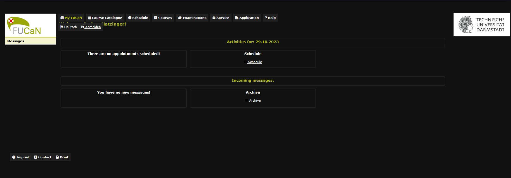
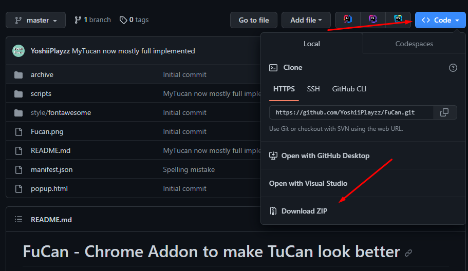
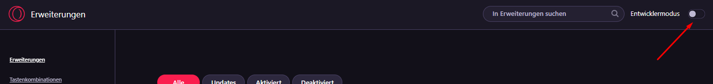
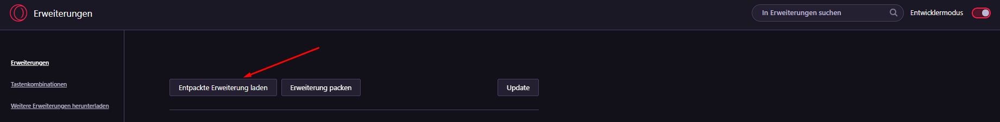

# FuCan - Chrome Addon to make TuCan look better 
## (F*ck TuCan standard design and make it clean)
This Addon redesigns the TuCan webpage
It is still Work in Progress so don't expect much of it
## Credits
Credits to Jonas Emrich´s project [BetterTUCaN](https://github.com/JonasEmrich/Better-TUCaN) for for Dark theme and statistics
## How to install
1. Download repository as .zip file 
2. Open browser [extension settings](chrome://extensions) `chrome://extensions`
3. Unzip file 
4. Activate developer mode
5. Load unzipped folder

## Features
- Replace TuCan logo with the FuCan logo
- Enables dark mode

## Planed features
- Dropdown navigation
- Course finder
- Overview of exams

## Known bugs / TODO
- header is displayed over text
- navigation bar isn't responsive
- there are no messages displayed on the message page
- resources (like fontawesome) aren't loaded correctly...
- make logo fitting to dark mode
- english page is not working correctly
## Disclaimer
The original "TUCaN" Logo and the Logo of "Technische University Darmstadt" belongs and is property of the Technische University Darmstadt 